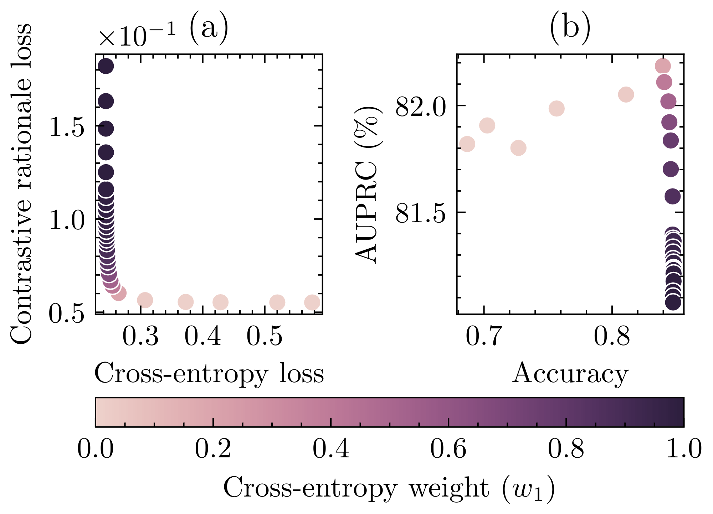

# plausible-nlp-explanations

Code and data of the paper:

> [Lucas Resck](https://lucasresck.github.io/), [Marcos M. Raimundo](https://ic.unicamp.br/docente/marcos-medeiros-raimundo/), [Jorge Poco](http://visualdslab.com/~jpocom/). "Exploring the Trade-off Between Model Performance and Explanation Plausibility of Text Classifiers Using Human Rationales," **NAACL Findings 2024**.

Check out the [paper](https://aclanthology.org/2024.findings-naacl.262/)!

## Instructions

Thank you for your interest in our paper and code.

Steps to reproduce our experiments:
1. **Setup**: Conda environment, data download, and optional model access request.
2. **Experiments**: raw experimental data generation with `experiments/` code;
3. **Figures and Tables**: final results generation with code at `notebooks/`.

### 1. Setup

#### 1.1. Conda Environment

Clone and enter the repository:
```
git clone https://github.com/visual-ds/plausible-nlp-explanations.git
cd plausible-nlp-explanations
```

Ensure `anaconda` or `miniconda` is installed. Then, create and activate the Conda environment:
```
cd conda
conda env create -f export.yml
conda activate plausible-nlp-explanations
```
> In case of package inconsistencies, you may also create the environment from `no_builds.yml` (which contains package versions without builds) or `history.yml` (package installation history).

Install `moopt`:
```
cd ../..
git clone https://github.com/marcosmrai/moopt.git
cd moopt
git checkout e2ab0d7b25e8d7072899a38dd2458e65e392c9f0
python setup.py install
```
> This is a necessary package for multi-objective optimization. For details, check [its repository](https://github.com/marcosmrai/moopt).

#### 1.2. Data

We point the reader to the original dataset sources and their respective licenses:

- Download **HateXplain** from [authors' GitHub](https://github.com/hate-alert/HateXplain/blob/2d804e29058726c76e835e043d9ec79169879fa6/Data/dataset.json) and save it into `data/hatexplain/`.
- Download **Movie Reviews** from [authors' webpage](https://web.archive.org/web/20170503215240/http://cs.jhu.edu/~ozaidan/rationales/) and extract it into `data/movie_reviews/`.
- Download **Tweet Sentiment Extraction** from [Kaggle](https://www.kaggle.com/competitions/tweet-sentiment-extraction/data) and extract it into `data/tweet_sentiment_extraction/`.
- Download **HatEval** dataset at the author's instantaneous [data request form](https://docs.google.com/forms/d/e/1FAIpQLSc3lVIM0hUqtGzQIPulpCNF9GkE9YEmq4-Ud_Qu4U-FyEsvgw/viewform) and extract it into `data/hateval2019/`. If the link is unavailable, we can share it under [CC BY-NC 4.0](https://creativecommons.org/licenses/by-nc/4.0/)—contact us.

`data` should look like this:
```
explainability-experiments
├── conda
├── data
│   ├── hateval2019
│   ├── hatexplain
│   ├── movie_reviews
│   └── tweet_sentiment_extraction
├── experiments
├── ...
```

#### 1.3 Optional Models Access Request

Request access to the models fine-tuned on HateXplain dataset at Hugging Face: [DistilBERT](https://huggingface.co/visual-ds/distilbert-base-uncased-hatexplain) and [BERT-Mini](https://huggingface.co/visual-ds/bert-mini-hatexplain).
Make sure to have set up a Hugging Face [user access token](https://huggingface.co/docs/hub/security-tokens) and added it to your machine running
```
huggingface-cli login
```

> We do not release HateXplain–fine-tuned models publicly because of ethical concerns. These models are only necessary for specific experiments though.

### 2. Experiments

#### 2.1. Main Experiments

To generate the raw experimental data, you can use the following command:
```
python experiments.py --datasets hatexplain movie_reviews \
    --explainers lime shap --models tf_idf distilbert \
    --negative_rationales 2 5 --experiments_path data/experiments/ \
    --performance_metrics accuracy recall \
    --explainability_metrics auprc sufficiency comprehensiveness \
    --random_state 42 --gpu_device 0 --batch_size 128
```
You can change the parameters as you wish. For example, to run the same experiment but with BERT-Mini, you can change `--models tf_idf distilbert` to `--models bert_mini`. For details, please check the help:
```
python experiments.py -h
```

#### 2.2. BERT-HateXplain Comparison

To run the BERT-HateXplain comparison, you can use the following command:
```
python comparison.py --datasets hatexplain_all --explainers lime \
    --models bert_attention --negative_rationales 2 \
    --experiments_path data/experiments/ \
    --performance_metrics accuracy recall \
    --explainability_metrics auprc sufficiency comprehensiveness \
    --random_state 42 --gpu_device 0 --batch_size 128 --n_jobs 1
```
You can also change the parameters as you wish. For details, please check the help:
```
python comparison.py -h
```

#### 2.3. Out-of-Distribution Results

To run the out-of-distribution experiments, simply run
```
python out_of_distribution.py
```

### 3. Figures and Tables

To generate the final figures and tables, run the Jupyter notebooks at the folder `notebooks/`. It is necessary to have LaTeX installed on your machine to generate the figures. For example, to generate Figure 3 (DistilBERT and HateXplain's trade-offs), run the notebook `notebooks/complete_graphic.ipynb`. For details, please check the notebooks.

<p align="center">
	
</p>

## Adaptation

A new dataset should be a new Python module at `experiments/datasets/` following the `Dataset` base class at `experiments/dataset.py`.
Then, it should be easy to add it to `experiments.py`.
The same is true for new models and explainers, and similar for `metrics.py`.
Feel free to open issues and pull requests.

## License

We release this code under the [MIT License](LICENSE).

## Citation

```
@inproceedings{resck_exploring_2024,
	address = {Mexico City, Mexico},
	title = {Exploring the {Trade}-off {Between} {Model} {Performance} and {Explanation} {Plausibility} of {Text} {Classifiers} {Using} {Human} {Rationales}},
	url = {https://aclanthology.org/2024.findings-naacl.262},
	booktitle = {Findings of the {Association} for {Computational} {Linguistics}: {NAACL} 2024},
	publisher = {Association for Computational Linguistics},
	author = {Resck, Lucas and Raimundo, Marcos M. and Poco, Jorge},
	editor = {Duh, Kevin and Gomez, Helena and Bethard, Steven},
	month = jun,
	year = {2024},
	note = {Also presented as a poster at the LatinX in NLP at NAACL 2024 workshop},
	pages = {4190--4216},
}
```
